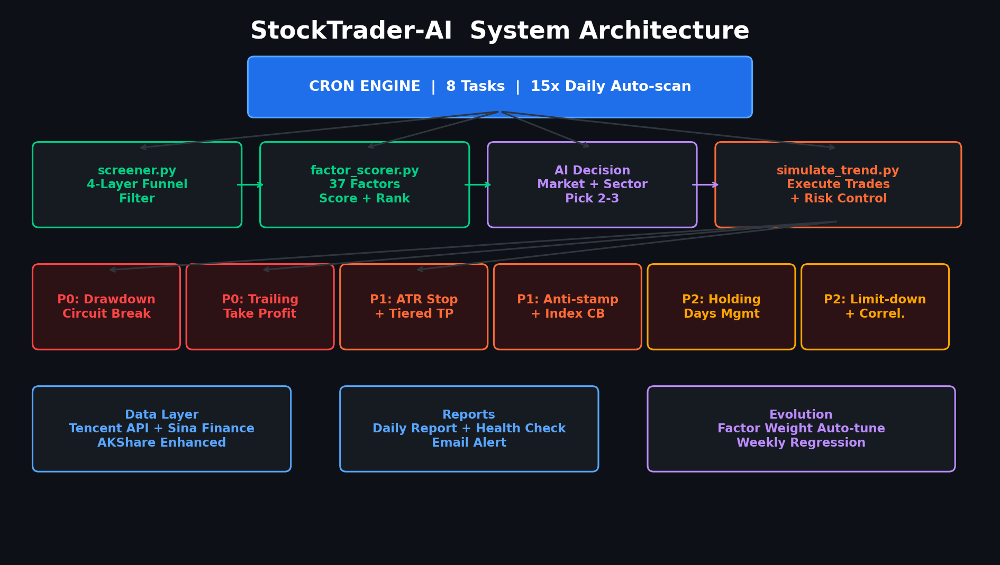

<div align="center">


# 🚀 StockTrader-AI

### **八层风控 · 37因子自进化 · A股全自动量化交易系统**

<br>


**不是玩具，是一个完整的量化交易系统。**

从选股到交易，从风控到日报，全流程自动化。
16 个模块 · 6400+ 行代码 · 8 层风控 · 37 个因子 · 每日 15 次自动盯盘。

<br>

[30秒上手](#-30秒上手) · [为什么选这个](#-为什么选-stocktrader-ai) · [架构](#-系统架构) · [风控](#️-八层风控体系) · [因子](#-量化因子系统) · [回测](#-回测引擎) · [路线图](#-路线图)

<br>

```
   ╔═══════════════════════════════════════════════════════════════╗
   ║                                                               ║
   ║   screener ──→ scorer ──→ AI决策 ──→ 交易引擎 ──→ 八层风控    ║
   ║     过滤         评分       选股        执行         保命       ║
   ║                                                               ║
   ║   4层漏斗     37个因子    市场感知    自动买卖     从P0到P2     ║
   ║                                                               ║
   ╚═══════════════════════════════════════════════════════════════╝
```

</div>

---

## 💡 为什么选 StockTrader-AI

市面上的量化框架要么太学术（回测好看实盘翻车），要么太玩具（一个脚本跑天下）。
这个项目的设计哲学是 **"先活下来，再谈赚钱"**。

**它能做什么：**

- 🎯 **自动选股** — 四层漏斗过滤 + 37 个因子评分，不是拍脑袋选
- 🤖 **自动交易** — 空仓自动建仓，触发条件自动买卖，零人工干预
- 🛡️ **自动风控** — 八层防护，从组合回撤熔断到个股跌停检测，层层保命
- 🧬 **自动进化** — 因子权重每周自动优化，越跑越聪明
- 📊 **自动日报** — 收盘自动生成报告，含夏普/回撤/相关性矩阵
- 📧 **自动告警** — 跌停、熔断、止盈，邮件即时通知
- 🧪 **自动回测** — 内置回测引擎，改参数立刻看效果

**它不能做什么：**

- ❌ 不能保证赚钱（没有任何系统能）
- ❌ 不能替代你的判断（AI 辅助决策，不是 AI 替代决策）
- ❌ 不能一夜暴富（稳健 > 激进）

---

## ⚡ 30秒上手

```bash
# 克隆
git clone https://github.com/zhou343-de/stock-trader-ai.git
cd stock-trader-ai

# 初始化 10 万虚拟资金
python3 scripts/simulate_trend.py init 100000

# 看看当前市场是什么环境
python3 scripts/market_regime.py

# 量化选股 — 四层漏斗筛出 Top 10
python3 scripts/stock_screener.py --top 10 --json

# 因子评分 — 从候选中评出 Top 5
python3 scripts/stock_screener.py --top 10 --json | \
  python3 scripts/factor_scorer.py --top 5 --json

# 一键回测 — 看看策略表现
python3 scripts/backtest.py --start 2026-01-05 --end 2026-03-31 --json
```

就这么简单。剩下的交给 Cron 自动调度。

---

## 🏗️ 系统架构



```
                    ┌─────────────────────────────┐
                    │     OpenClaw Cron 引擎       │
                    │   8 个定时任务 · 交易日感知    │
                    └──────────────┬──────────────┘
                                   │
          ┌────────────────────────┼────────────────────────┐
          │                        │                        │
          ▼                        ▼                        ▼
   ┌─────────────┐        ┌─────────────┐        ┌─────────────┐
   │   选股层     │        │   交易层     │        │   监控层     │
   │             │        │             │        │             │
   │ screener    │───┐    │ simulate    │    ┌───│ monitor     │
   │ 四层漏斗     │   │    │ 交易引擎     │    │   │ 盯盘引擎     │
   │             │   │    │             │    │   │             │
   │ scorer      │   │    │ rotation    │    │   │ daily       │
   │ 37因子评分   │   └───→│ 板块轮动     │←───┘   │ 日报生成     │
   │             │        │             │        │             │
   │ regime      │        │ akshare     │        │ health      │
   │ 市场环境     │        │ 增强因子     │        │ 健康检查     │
   └─────────────┘        └─────────────┘        └─────────────┘
          │                        │                        │
          └────────────────────────┼────────────────────────┘
                                   ▼
                    ┌─────────────────────────────┐
                    │         数据层               │
                    │  腾讯行情 · 新浪财经 · AKShare │
                    └─────────────────────────────┘
```

### 选股流水线

```
    ┌──────────────────────────────────────────────────────────┐
    │                    stock_screener.py                      │
    │                                                          │
    │   基本面过滤 ──→ 多因子预排序 ──→ 技术验证 ──→ 流动性检查  │
    │   PE/市值       非纯涨幅排序     均线/MACD      滑点≤0.5%  │
    │   成交额>3000万  市值+成交额     量比/放量                  │
    │                              ≥ 2/4 通过                   │
    │                         ↓ 10 只候选                       │
    └──────────────────────────┬───────────────────────────────┘
                               │
    ┌──────────────────────────▼───────────────────────────────┐
    │                    factor_scorer.py                       │
    │                                                          │
    │   10 基础因子 ──→ 27 增强因子 ──→ 板块轮动加分             │
    │   动量/量能       KDJ/布林带/OBV   行业排名加权             │
    │   均线/MACD       RSI/CCI/威廉                             │
    │   RSI/波动率      量价背离/支撑阻力                         │
    │                         ↓ Top 5                          │
    └──────────────────────────┬───────────────────────────────┘
                               │
    ┌──────────────────────────▼───────────────────────────────┐
    │                      AI 决策层                            │
    │                                                          │
    │   综合评分 × 市场环境 × 行业轮动 → 选 2-3 只，行业互补     │
    └──────────────────────────┬───────────────────────────────┘
                               │
    ┌──────────────────────────▼───────────────────────────────┐
    │                  simulate_trend.py                        │
    │                                                          │
    │   下单 → ATR止损 → 分级止盈 → 移动止盈 → 回撤熔断 → 平仓  │
    └──────────────────────────────────────────────────────────┘
```

---

## 🛡️ 八层风控体系

> **"活下来比赚钱重要。"**
>
> 很多量化系统死在风控上——回测曲线漂亮，实盘一个黑天鹅就清零。
> 这个系统的风控不是装饰，是核心设计。八层防护，从组合级到个股级，层层递进。

```
    ┌───────────────────────────────────────────────────────────┐
    │                     P0 · 生存层                           │
    │                                                           │
    │   ┌─────────────────┐    ┌─────────────────┐             │
    │   │  组合回撤熔断     │    │    移动止盈      │             │
    │   │  峰值回撤≥10%    │    │  盈利回撤50%     │             │
    │   │  → 全清+冻结3日  │    │  → 锁定利润      │             │
    │   └─────────────────┘    └─────────────────┘             │
    └───────────────────────────────────────────────────────────┘
    ┌───────────────────────────────────────────────────────────┐
    │                     P1 · 控制层                           │
    │                                                           │
    │   ┌──────────┐  ┌──────────┐  ┌──────────┐              │
    │   │ ATR止损   │  │ 分级止盈  │  │ 防踩踏   │              │
    │   │ 动态调整  │  │ 三档减仓  │  │ 指数熔断  │              │
    │   └──────────┘  └──────────┘  └──────────┘              │
    └───────────────────────────────────────────────────────────┘
    ┌───────────────────────────────────────────────────────────┐
    │                     P2 · 精细层                           │
    │                                                           │
    │   ┌──────────┐  ┌──────────┐  ┌──────────┐              │
    │   │ 持仓天数  │  │ 跌停检测  │  │ 相关性   │              │
    │   │ 管理     │  │ 封板告警  │  │ 监控     │              │
    │   └──────────┘  └──────────┘  └──────────┘              │
    └───────────────────────────────────────────────────────────┘
```

| 层级 | 机制 | 触发条件 | 执行动作 |
|:---:|:---|:---|:---|
| **P0** | 组合回撤熔断 | 峰值总资产回撤 ≥ 10% | 全部清仓 + 冻结交易 3 个交易日 |
| **P0** | 移动止盈 | 浮盈曾达 ≥ 10% 后回落至最高浮盈的 50% | 全部卖出锁定利润 |
| **P1** | ATR 动态止损 | 止损 = -1.5 × 20日ATR / 买入价 | 高波动自动放宽止损空间 |
| **P1** | 分级止盈 | TP1 / TP2 / TP3（环境自适应） | 分三档各减仓 1/3 |
| **P1** | 防踩踏 + 指数熔断 | ≥50% 持仓跌 > 3% 或上证跌 ≥ 3% | 暂停买入 + 收紧止损至 -3% |
| **P2** | 持仓天数管理 | 持有 ≥ 20 天且浮盈未达 TP1 | 强制平仓释放资金 |
| **P2** | 跌停封板检测 | 开盘一字跌停 | 告警邮件 + 次日优先处理 |
| **P2** | 持仓相关性监控 | 任意两只持仓相关系数 ≥ 0.7 | 分散化警告 + 换股建议 |

### 市场环境自适应

| 环境 | 止损 | TP1 | TP2 | TP3 | 最大仓位 | 最多持仓 |
|:---:|:---:|:---:|:---:|:---:|:---:|:---:|
| 🐂 **牛市** | -8% | 15% | 25% | 35% | 90% | 4 只 |
| 📊 **震荡** | -7% | 15% | 25% | 35% | 85% | 3 只 |
| 🐻 **熊市** | -4% | 10% | 18% | 25% | 60% | 2 只 |

> 牛市给趋势呼吸空间，熊市优先保护本金。系统自动识别环境，无需手动切换。

---

## 📊 量化因子系统

### 10 个基础因子

| 因子 | 权重 | 说明 |
|:---|:---:|:---|
| `change_pct` | 25 | 涨跌幅 |
| `volume_ratio` | 20 | 量比 |
| `ma_aligned` | 20 | 均线多头排列 |
| `macd_signal` | 15 | MACD 信号 |
| `turnover` | 10 | 换手率 |
| `amount` | 10 | 成交额 |
| `relative_strength` | 20 | 相对强度 |

### 27 个增强因子

```
┌─────────────────────────────────────────────────────────────┐
│                                                             │
│  多周期动量    momentum_5d / 10d / 20d / 60d + 加速度        │
│  波动率结构    upside_vol / downside_vol                     │
│  量价背离      vol_price_divergence（价涨量缩检测）           │
│  KDJ          kdj_k / d / j + 金叉死叉信号                  │
│  布林带        boll_pct_b + bandwidth                       │
│  OBV          obv_direction + trend（能量潮）                │
│  多周期RSI     rsi_7d / 14d / 28d + combo                   │
│  价格位置      price_position_60d（距高低点）                 │
│  成交额集中度  volume_concentration                          │
│  支撑阻力      support / resistance_distance                 │
│  威廉指标      williams_r                                    │
│  CCI          cci（顺势指标）                                │
│  相对强弱      rs_vs_index_20d（个股vs大盘）                  │
│  均线距离      price_vs_ma20 / ma60                          │
│                                                             │
└─────────────────────────────────────────────────────────────┘
```

### 因子权重自进化

```
交易反馈 → 因子贡献分析 → 权重调整 → 下一轮交易
    ↑                                    │
    └────────────────────────────────────┘
              每周五自动迭代
```

- 📊 收集最近 20 笔交易，过滤污染样本（熔断/超时平仓）
- 📈 计算各因子贡献与收益的相关性
- ⚖️ 贡献高的 +2，贡献低的 -2
- 🔄 每周向初始值回归 3%（防漂移）
- 🚧 边界约束：每个因子权重 ∈ [5, 40]

---

## 🕐 自动调度

```
  09:30 ─┬─ 早盘盯盘（回撤熔断/移动止盈/ATR止损）
  09:45 ─┼─ 开盘建仓（空仓触发，延后15分钟避开波动）
  09:50 ─┤
  10:00 ─┤
  10:20 ─┤
  10:40 ─┼─ 智能盯盘 ×6（每20分钟，含止盈止损检查）
  11:00 ─┤
  11:20 ─┤
  11:40 ─┤
  ───── 午休 ─────
  13:00 ─┤
  13:20 ─┤
  13:40 ─┤
  14:00 ─┼─ 午后盯盘 ×6（每20分钟）
  14:20 ─┤
  14:40 ─┤
  15:10 ─┼─ 尾盘风控（只卖不买）
  15:30 ─┼─ 收盘日报（夏普/回撤/相关性矩阵）
  16:00 ─┼─ 健康检查（异常邮件告警）
  ───── 周五额外 ─────
  16:00 ─┴─ 周度策略优化（因子权重自进化）
```

> 📅 自动识别法定节假日（30天）和调休交易日（3天），非交易时段智能跳过。

---

## 🧪 回测引擎

内置日K线级全流程回测，不是简单的买卖模拟——它跑的是完整的选股 → 评分 → 交易 → 风控链路。

```bash
python3 scripts/backtest.py --start 2026-01-05 --end 2026-03-31 --json
```

**输出指标：**

| 指标 | 说明 |
|:---|:---|
| 累计收益率 | 区间总收益 |
| 年化收益率 | 标准化到年度 |
| 最大回撤 | 最大峰谷跌幅 |
| 夏普比率 | 风险调整后收益 |
| 胜率 | 盈利交易占比 |
| 盈亏比 | 平均盈利 / 平均亏损 |
| 交易明细 | 每笔买卖记录 |

---

## 📁 项目结构

```
stock-trader-ai/
│
├── scripts/                        # 🔧 核心引擎
│   ├── monitor.py                  #   盯盘主引擎（风控+止盈+止损+跌停检测）
│   ├── simulate_trend.py           #   交易引擎（买卖/状态/ATR/熔断）
│   ├── stock_screener.py           #   选股引擎（四层漏斗过滤）
│   ├── factor_scorer.py            #   评分引擎（10+27因子）
│   ├── market_regime.py            #   市场环境识别（bull/range/bear）
│   ├── sector_rotation.py          #   板块轮动检测（14个行业）
│   ├── akshare_data.py             #   增强因子模块（27个技术因子）
│   ├── backtest.py                 #   回测引擎（全流程模拟）
│   ├── debate_selector.py          #   多Agent辩论选股（猎手/账房/守夜人）
│   │
│   ├── daily_report.py             #   📊 日报生成
│   ├── health_check.py             #   🏥 健康检查
│   ├── batch_query.py              #   📡 批量行情
│   ├── get_price.py                #   📈 单股行情
│   ├── get_news.py                 #   📰 财经新闻
│   ├── send_email.py               #   📧 邮件推送
│   └── time_guard.py               #   ⏰ 交易时段守卫
│
├── data/                           # 💾 数据目录
│   ├── trend_account.json          #   账户状态
│   ├── scoring_weights.json        #   因子权重配置
│   └── trading_calendar.json       #   交易日历（2026年）
│
├── config/                         # ⚙️ 配置
│   └── smtp.env.example            #   邮件配置模板
│
├── SKILL.md                        # OpenClaw 技能定义
├── README.md
├── LICENSE                         # MIT
└── .gitignore
```

---

## ⚙️ A 股铁律

系统内置 A 股交易规则，硬编码，不可绕过：

| 规则 | 实现 |
|:---|:---|
| **T+1** | 买入当日不可卖出 |
| **100股取整** | 主板/创业板 100 股起，科创板 200 股起 |
| **涨跌幅限制** | 主板 ±10%，创业板 ±20%，ST ±5% |
| **价格笼子** | 主板 ±2% 且 ±0.10 元，创业板 ±2% |
| **交易费用** | 佣金万3（最低5元）+ 过户费 0.001% + 印花税 0.05% |
| **防踩踏** | ≥50% 持仓同时大跌 → 暂停买入 |

---

## 🗺️ 路线图

- [x] 基础选股 + 交易引擎
- [x] 八层风控体系
- [x] 27 个增强因子
- [x] 因子权重自进化
- [x] 内置回测引擎
- [x] 多Agent辩论选股
- [x] 持仓相关性监控
- [ ] **机器学习因子挖掘** — 用 XGBoost/LightGBM 自动发现新因子
- [ ] **多策略并行** — 趋势跟踪 + 均值回归 + 事件驱动
- [ ] **实盘对接** — 通过券商 API 接入真实交易
- [ ] **Web Dashboard** — 实时监控面板（持仓/收益/风控状态）
- [ ] **社群信号共享** — 策略信号订阅 + 组合跟投

---

## 📜 免责声明

> ⚠️ **本项目仅供学习和研究目的。**
>
> - 所有交易均为虚拟盘模拟，不涉及真实资金
> - 不构成任何投资建议
> - 量化策略的历史表现不代表未来收益
> - 使用者需自行承担因使用本项目产生的任何风险
>
> **投资有风险，入市需谨慎。**

---

## 🤝 Contributing

欢迎提交 Issue 和 Pull Request！

```
Fork → Branch → Code → Test → PR
```

1. Fork 本仓库
2. 创建特性分支 (`git checkout -b feature/amazing-feature`)
3. 提交更改 (`git commit -m 'feat: amazing feature'`)
4. 推送到分支 (`git push origin feature/amazing-feature`)
5. 开启 Pull Request

---

<div align="center">

### ⭐ 如果觉得有用，点个 Star 鼓励一下

<br>


<br>

**Built with ❤️ for A股散户**

</div>
